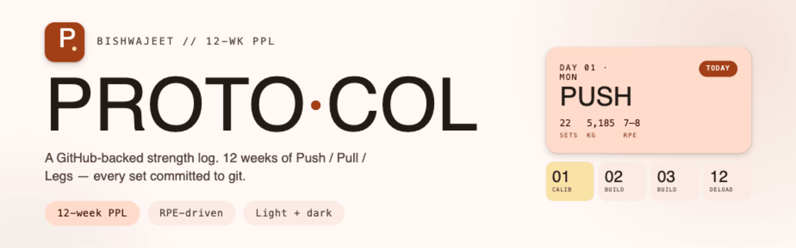

<p align="center">
  
</p>

A GitHub-backed training app. **Every interaction — tick a set, edit a weight, complete a session — becomes a real git commit.** The commit history _is_ the training journal.

[](https://workout.bishwajeetparhi.dev/)
[](LICENSE)
[](#architecture)

A static site and a small API, both deployed as Cloudflare Workers. The API proxies state writes through to a JSON file in _your_ GitHub repo — so the data is version-controlled and owned by you, with no third-party database.

```
┌─────────────┐    HTTPS     ┌──────────────────┐   GitHub API   ┌──────────┐
│ Browser     │─────────────▶│ API Worker       │───────────────▶│ Your     │
│             │  + password  │ (protocol-store) │   + PAT        │ repo     │
└─────────────┘              └──────────────────┘                └────┬─────┘
      ▲                                                                │
      │   static site (HTML/CSS/JS)                                    │ data/state.json
      │                                                                │  = training journal
┌─────┴────────────────┐
│ Site Worker          │   ◀── both served from Cloudflare,
│ (Cloudflare Assets)  │       free tier
└──────────────────────┘
```

- **Site Worker** — serves the static files (`index.html`, `css/`, `js/`, `assets/`). Custom domain: `workout.bishwajeetparhi.dev`.
- **API Worker** (`protocol-store`) — single `/state` endpoint. Custom domain: `api.workout.bishwajeetparhi.dev`.
- **GitHub** — stores the source _and_ `data/state.json`, your training log. The API Worker is the only thing that writes to it.

The API Worker holds the GitHub token. The browser only knows a shared password. The repo can stay public on a free GitHub account — nothing sensitive lives in the source.

---

## Run your own

Fork it and follow the setup below. Everything is free-tier (Cloudflare Workers + GitHub).
You deploy **two** Workers — the API, then the static site.

### 1. Fork / clone the repo

```bash
git clone https://github.com/<you>/workout-plan.git
cd workout-plan
npm install -g wrangler
wrangler login
```

### 2. Create a fine-grained GitHub token

GitHub → Settings → Developer settings → Personal access tokens → **Fine-grained tokens** → Generate new token.

- **Repository access**: Only select repositories → pick this one repo
- **Repository permissions** → Contents → **Read and write**
- Everything else: no access

Generate, copy the token (starts with `github_pat_…`). You'll only see it once.

### 3. Deploy the API Worker

Edit `worker/wrangler.toml`:

- Set `REPO_OWNER` / `REPO_NAME` to your GitHub username and this repo.
- Set `ALLOWED_ORIGIN` to wherever the site will live (your custom domain, or the site Worker's `*.workers.dev` URL).
- The `[[routes]]` block binds the API to a custom domain (`api.<yourdomain>`). If you don't have a domain on Cloudflare yet, delete that block — `workers_dev = true` still gives you a `https://protocol-store.<you>.workers.dev` URL.

```bash
cd worker
wrangler deploy
```

Set the secrets:

```bash
wrangler secret put GITHUB_TOKEN     # paste the PAT from step 2
wrangler secret put APP_PASSWORD     # pick a strong password — 20+ chars
```

Quick check it's alive:

```bash
curl https://api.<yourdomain>/health   # or the workers.dev URL
# → {"ok":true,"service":"protocol-store"}
```

### 4. Deploy the site Worker

The repo root holds `wrangler.jsonc`, which serves the static files as a Cloudflare Worker (Static Assets). From the repo root:

```bash
wrangler deploy
```

This gives you a `https://workout-plan.<you>.workers.dev` URL.

### 5. Custom domains (optional)

In the Cloudflare dashboard → Workers & Pages → your worker → **Settings → Domains & Routes**, add a custom domain to each Worker:

- site Worker → `workout.<yourdomain>`
- API Worker → `api.<yourdomain>` (already wired via `[[routes]]` in `worker/wrangler.toml`)

Cloudflare manages the DNS and TLS — there is **no `CNAME` file** in the repo (that's a GitHub Pages thing; this site isn't on Pages).

### 6. Connect the app

Open your site. The setup modal appears.

- **Worker URL**: your API Worker URL — `https://api.<yourdomain>` (or the `protocol-store.<you>.workers.dev` URL)
- **App Password**: whatever you set in step 3

Tap **Connect**. The app seeds an initial `data/state.json` in your repo as the first commit, and you're live. Each device does this once — the URL + password get stashed in that device's `localStorage`.

---

## Build your own training plan

This repo ships a personal 12-week Push/Pull/Legs programme. The plan isn't hardcoded magic — it's two layers you can rewrite for yourself:

1. **`data/instructions.md`** — the coaching framework. It's written as a system prompt for an AI personal trainer: athlete profile, current working weights, and the programming rules (RPE-based loading, when to add weight, deload cadence, how Week 1 is treated as calibration). **Start here.** Read it, then build on it — swap in your own profile, goals, equipment, injuries, and working weights.

2. **`js/data/`** — the programme as code:
   - `sessions.js` — `SESSIONS = { 1: […], …, 12: […] }`, every week's sessions (exercises, sets, reps, RPE targets).
   - `programme.js` — block structure and per-week focus.
   - `default-state.js` — the starting working weights seeded into `data/state.json` on first save.

### Workflow

1. **Edit `data/instructions.md`** — replace the athlete profile and working weights with yours. This file is your brief: hand it to an AI coach (or use it yourself) to design a block that fits your goals.
2. **Encode the result in `js/data/`** — translate the designed weeks into `sessions.js` / `programme.js`. The state model keys `in_progress` by `${week}-${sessionId}`, so adding or editing weeks Just Works.
3. **Set your starting loads** — either edit `default-state.js`, or just enter them in the app (the Weights view) once you're connected.
4. **Train and log** — tick sets and complete sessions in the app. Each action commits. Working weights live in `data/state.json`; the commit history is your journal.
5. **Progress and update** — follow the rules in `instructions.md`: bump a working weight when you hit the top of the rep range at the target RPE for two sessions (upper-body compounds +2.5 kg, lower-body +5 kg, accessories add reps first); deload every 4–6 weeks.

### Supporting files in `data/`

- `instructions.md` — the AI-coach system prompt / programming rules (described above).
- `exerciselibrary.txt` — approved / substitute / excluded movements, so the plan stays inside your preferences and equipment.
- `liftlog.txt` — running log of sessions in `Exercise | Sets x Reps | Weight | RPE | Notes` form.
- `12weekprogramme.txt` — a per-block working-weight tracker (start / end of each block).

> These files contain the author's real numbers as a worked example — overwrite them with your own. See `CLAUDE.md` for the design language and the static-structure-vs-mutable-state split.

---

## Daily use

Tick sets, edit weights, complete sessions. Each action triggers a debounced commit (~2.5s after your last interaction) with an informative message:

```
Tick: Bench Press (Push)
Update weight: Hack Squat — → 90 kg
Complete session: Push (Wk 01)
```

The sync pill (top right) shows status: `Synced` / `Pending` / `Syncing` / `Error`.

---

## Architecture

No build step, no framework, no bundler — just native ES modules the browser loads directly.

- **`index.html`** — app shell: `<head>`, boot screen, setup modal, nav, view containers.
- **`css/style.css`** — all styling. Design tokens (colors, fonts, spacing) live in CSS custom properties at the top.
- **`js/`** — ES modules:
  - `app.js` — boot, view switching, glue
  - `store.js` — remote-synced state; the only thing that writes through the Worker
  - `config.js` — `localStorage` config (Worker URL + password)
  - `data/` — static programme structure: `programme.js`, `sessions.js` (all 12 weeks), `default-state.js`
  - `render/` — one module per view: `dashboard.js`, `programme.js`, `weights.js`, `log.js`, `session.js`
  - `ui/` — `setup-modal.js`, `status.js`
- **`worker/src/index.js`** — the API Worker. One endpoint `/state` (GET + POST), health probe at `/health`. Validates `X-App-Password`, reads/writes the state file via the GitHub Contents API.
- **`wrangler.jsonc`** (root) — config for the static-site Worker.
- **`data/state.json`** — your training log. Created on first save; its commit history is your journal.

**Static structure vs. mutable state**: the programme (weeks, sessions, exercise list) is code in `js/data/`. Everything that changes over time (working weights, in-progress ticks, the session log) lives in `data/state.json`. They're deliberately kept separate.

State shape:

```json
{
  "version": 1,
  "athlete": "Bishwajeet",
  "current_block": 1,
  "current_week": 1,
  "working_weights": {
    "push": [{ "key": "bench", "name": "Bench Press", "weight": 77, "unit": "kg" }, …],
    "pull": [...], "legs": [...], "acc": [...]
  },
  "in_progress": { "1-push-1": [0, 1, 2] },
  "log": [
    { "date": "2026-05-18T…", "week": 1, "name": "Push", "sets": 22, "vol": 3445, "focus": "…" }
  ],
  "updated_at": "2026-05-18T…"
}
```

---

## Project layout

```
.
├── index.html                # app shell
├── css/style.css             # all styles + design tokens
├── js/
│   ├── app.js                # boot + glue
│   ├── store.js              # remote-synced state
│   ├── config.js             # device config (Worker URL + password)
│   ├── data/                 # programme.js, sessions.js, default-state.js
│   ├── render/               # dashboard, programme, weights, log, session
│   └── ui/                   # setup-modal, status
├── worker/
│   ├── src/index.js          # API Worker (/state, /health)
│   └── wrangler.toml         # API Worker config
├── wrangler.jsonc            # static-site Worker config (serves the repo)
├── data/
│   ├── state.json            # training state (source of truth)
│   └── *.txt, instructions.md# your plan inputs — see "Build your own training plan"
├── assets/                   # favicons, icons, OG image
├── CLAUDE.md                 # contributor/AI context + design rules
└── LICENSE
```

---

## Troubleshooting

**"Can't reach Worker"** — `curl <url>/health` directly. If that 404s, the API Worker isn't deployed. If it times out, check `wrangler deploy` output for the actual URL.

**"Bad password"** — re-run `wrangler secret put APP_PASSWORD`, refresh the page, re-enter.

**Save errors with `403`** — PAT lacks contents:write on this repo, or has expired. Regenerate.

**Save errors with `404`** — `REPO_OWNER` / `REPO_NAME` in `wrangler.toml` are wrong, or the repo is private and the PAT can't access it.

**CORS error in the console** — `ALLOWED_ORIGIN` in `worker/wrangler.toml` doesn't match the origin you're loading the site from. Fix it and `wrangler deploy` the API Worker again.

**Want to reset everything** — API Worker side: `wrangler secret delete GITHUB_TOKEN && wrangler secret delete APP_PASSWORD`. Client side: open devtools console → `localStorage.clear()`. Or tap the sync pill in the top bar to re-open setup.

---

## License

[MIT](LICENSE) © 2026 Bishwajeet Parhi.

The programme itself is a personal training plan — use the code freely, but it's not medical or coaching advice.
